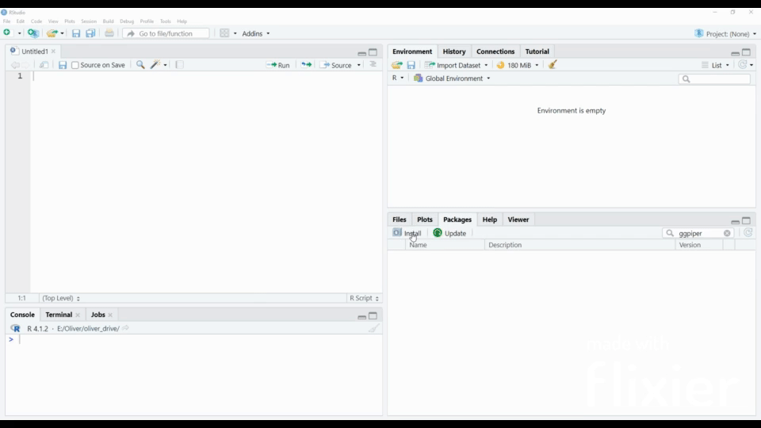

```{r opts, echo = FALSE}
knitr::opts_chunk$set(
  fig.path = "doc/images/"
)
```

**This is a fork of the gist <https://gist.github.com/johnDorian/5561272> (by Jason Lessels, <jlessels@gmail.com>).** Forking a gist into a git-repository unfortunately does not preserve the relation to the forked project, sorry for that.

Jasons comments:

> This was written quickly, and most likely contains bugs - I advise you to check it first. This now consists of two functions. *transform\_piper\_data()* transforms the data to match the coordinates of the piper diagram. *ggplot\_piper()* does all of the background.


## Background Informations


## Features
- Create Piper plot

## Usage
``` r
library("ggpiper")
```


## Installation

Currently only manual installation via a .zip file is possible. Under Releases you can download the package. Then start RStudio in the tab "Packages" you will find a button 'Install'. Click this button and a new window will open. Select 'Install form:' Package Archive File (.zip, .tar.gz) choose the downloaded file and then confirm with 'Install'. Now the package will be installed.  


## Example
Dataframe with at least follow columns necessary:
Ca, Mg, Na, K, Cl, SO4, CO3, HCO3, IDs

```{r}
df_ions <- read.csv2("samples/ions.csv")
df_ions
```
Input data need to be percent of meq/L!

*meq/L = mmol/L \* valence* ([Wikipedia: Equivalent (chemistry)](https://en.wikipedia.org/wiki/Equivalent_(chemistry))) with

| element | valence |
|---------|---------|
| Ca      | 2       |
| Mg      | 2       |
| Na      | 1       |
| K       | 1       |
| Cl      | 1       |
| SO4     | 2       |
| CO3     | 2       |
| HCO3    | 1       |

- All anions (Ca, Mg, Na, K) and cations (Cl, SO4, CO3, HCO3) **must be present in percentage values**. 
The conversion from absolute values in (mmol/l) to percentage values (%) can be done using the function toPercent() from the 'hydrogeo' package
```{r warning=FALSE}
library(hydrogeo)
data <- toPercent(df_ions)
```


Calculation of the coordinate values for the later diagram
Input data need to be percent of mmol/l !
```{r warning=FALSE}
library(ggpiper)
piper_data <- transform_piper_data(Ca   = data$Ca,
                                   Mg   = data$Mg,
                                   Cl   = data$Cl,
                                   SO4  = data$SO4,
                                   name = data$IDs)
```

With the function only the background is plotted. Colored points can be added using the observation values

```{r eval=FALSE, warning=FALSE}
ggplot_piper() + geom_point(aes(x,y, colour=factor(observation)), data=piper_data)
```


### Check
... should add up to 100%

```{r check}
cation.sums <- apply(data[, c("Ca", "Mg", "Na", "K")], 1, FUN = sum)
anion.sums  <- apply(data[, c("Cl", "SO4", "CO3", "HCO3")], 1, FUN = sum)
```


## More Plots

The piper function now just plots the background

```{r basePlot, fig.asp=1, fig.width=10, warning=FALSE}
ggplot_piper()
```

Now points can be added like...

```{r withPoints, fig.width=10, fig.asp=1, warning=FALSE}
ggplot_piper() + geom_point(aes(x,y), data=piper_data)
```

... colouring the points can be done using the observation value

```{r withColouredPoints, fig.width=10, fig.asp=1, warning=FALSE}
ggplot_piper() + geom_point(aes(x,y, colour=factor(observation)), data=piper_data)
```

The size can be changed like..

```{r withColouredResizedPoints, fig.width=10, fig.asp=1, warning=FALSE}
ggplot_piper() + geom_point(aes(x,y, colour=factor(observation)), size=4, data=piper_data)
```
